# 📍 NearServe — Hyperlocal Services Marketplace

> A full-stack web application that connects users with verified local service providers in their city, with real-time booking management ,role-based dashboards, AI-powered platform ,OTP authentication, and live deployment.
> 
---

## 🌐 Live Demo

🔗 **Live Website:** https://nearserve-two.vercel.app/


📂 **GitHub Repository:** https://github.com/RVedanti/nearserve

---

# 📸 Application Screenshots

---
## 🏠 Homepage

<p align="center">
  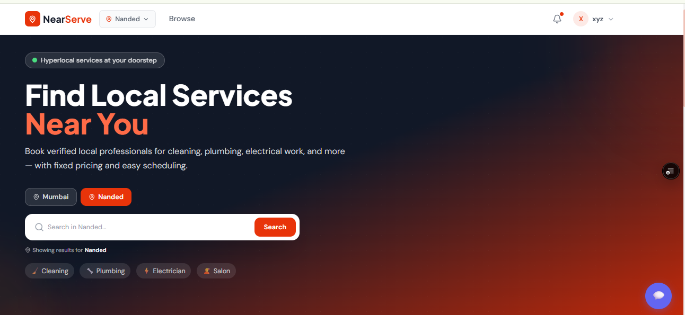
  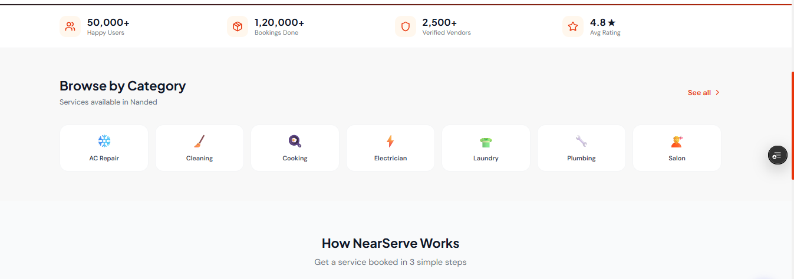
  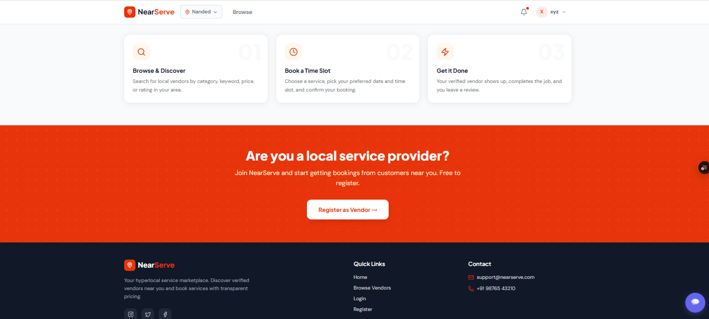
</p>

---

## 🔐 Authentication

<table align="center">
<tr>
<td align="center" width="50%">

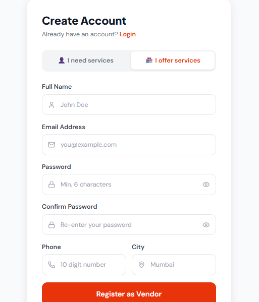

</td>

<td align="center" width="50%">

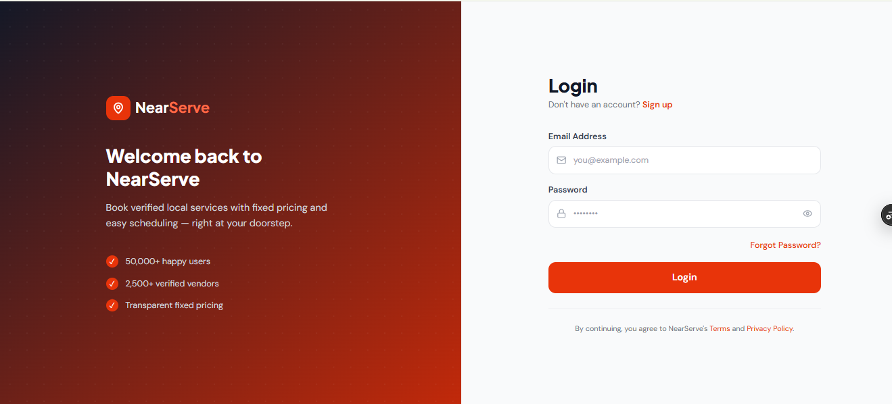

<br><br>

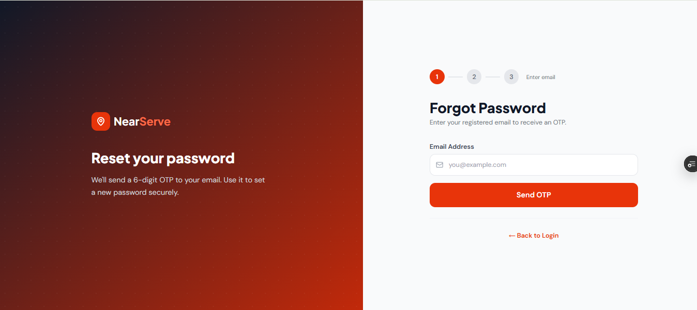

</td>
</tr>
</table>

## 🤖 AI Chatbot

<p align="center">
  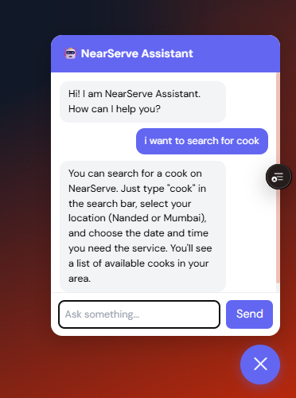
</p>

---

## 📅 Booking & Review

| **Booking** | **Review** |
|:-----------:|:----------:|
| 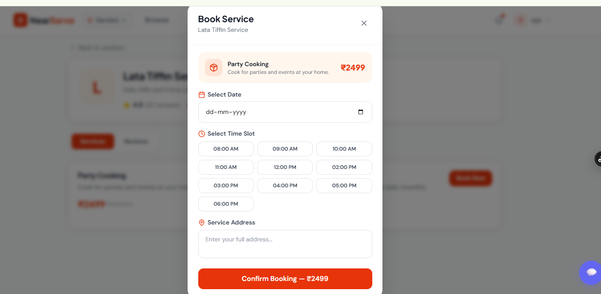 | 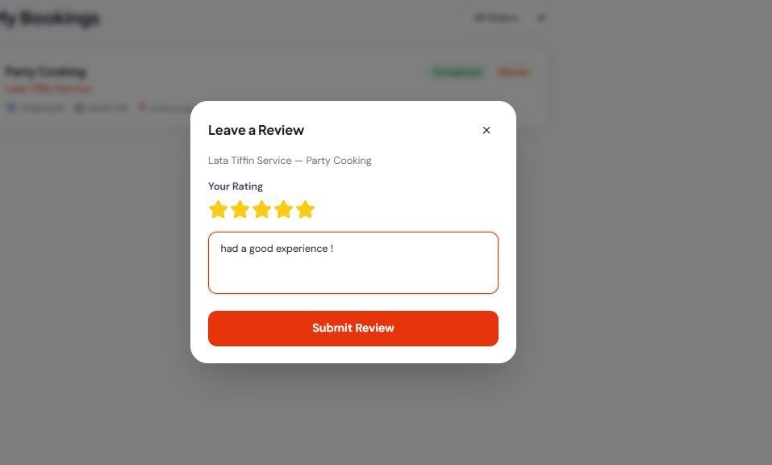 |

---

## 👤 User Dashboard

| **Overview** | **My Bookings** |
|:------------:|:---------------:|
| 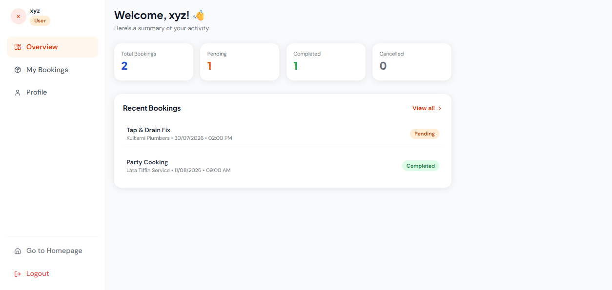 | 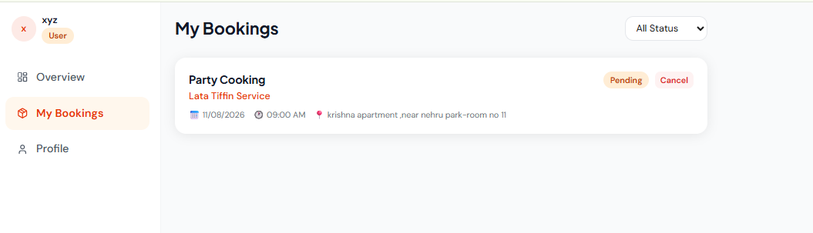 |

<br>

<p align="center">
  <strong>Profile</strong><br><br>
  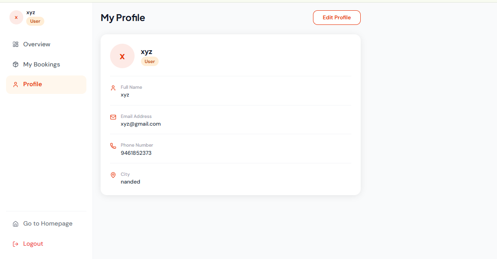
</p>

---

## 🧑‍🔧 Vendor Dashboard

| **Service Providers** | **Overview** |
|:---------------------:|:------------:|
| 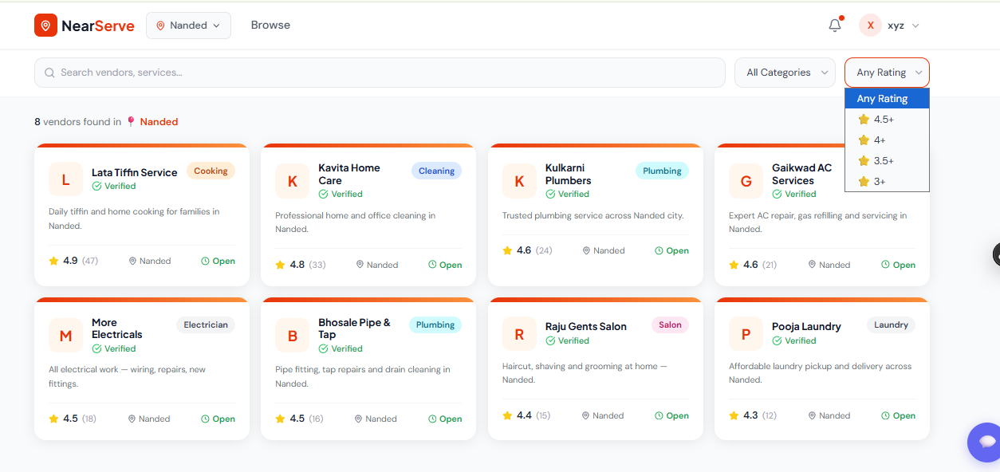 | 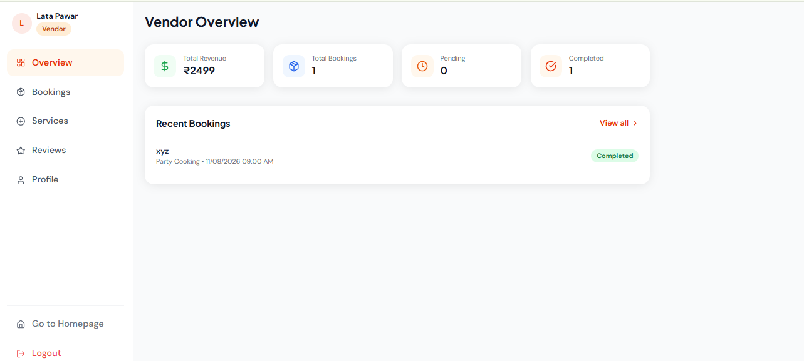 |

<br>

| **Services** | **Profile** |
|:------------:|:-----------:|
| 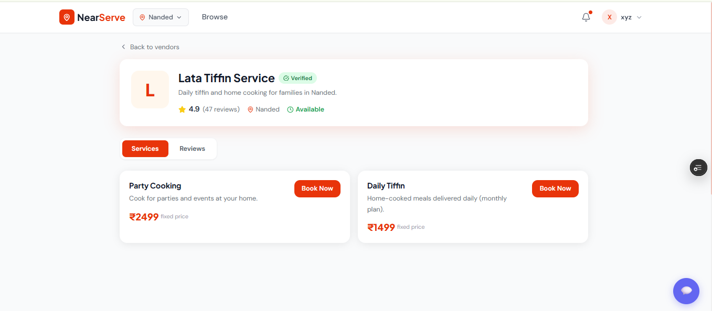 | 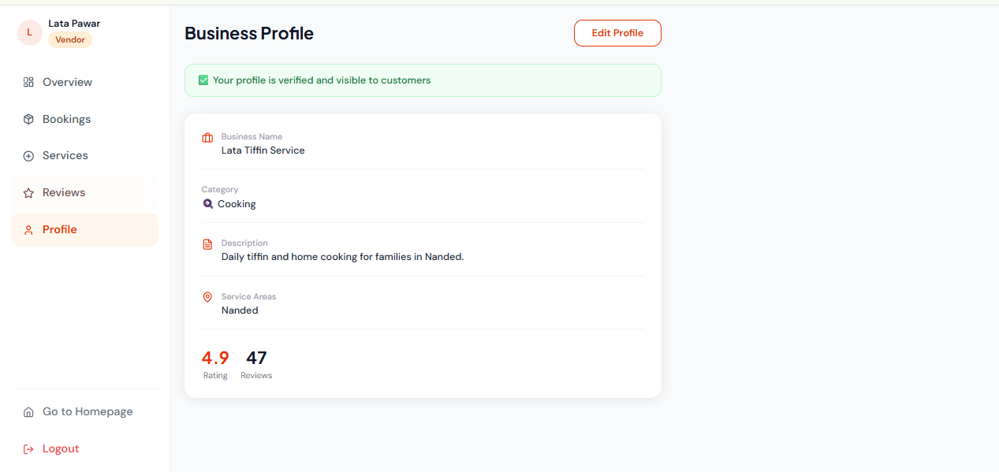 |

---

## 👨‍💼 Admin Dashboard

| **Analytics** | **Manage Vendors** |
|:-------------:|:------------------:|
| 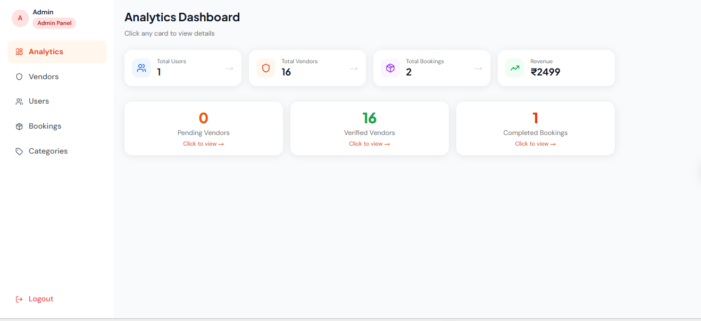 | 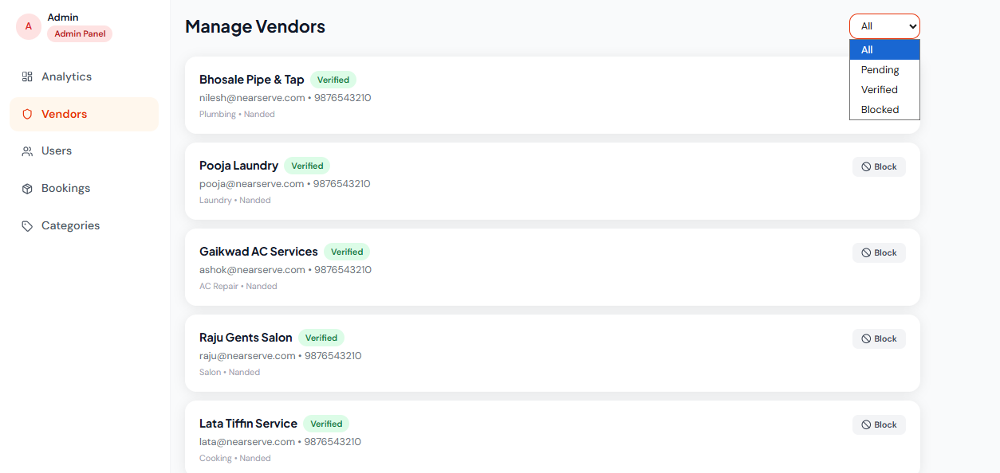 |

<br>

| **Categories** | **Bookings** |
|:--------------:|:------------:|
| 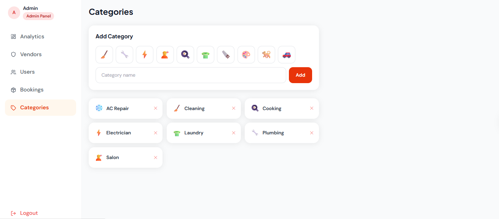 | 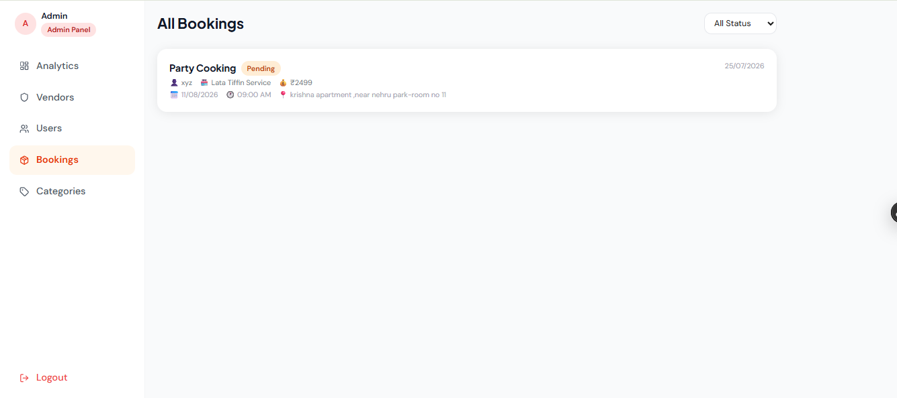 |

---
---

# ✨ Features

## 👤 User
- Register & Login with JWT Authentication
- Forgot Password using OTP Email Verification
- Select city (Mumbai / Nanded)
- Browse verified vendors by category
- Search & filter vendors
- Book services with date, time & address
- Track booking status (Pending → Accepted → Completed)
- Cancel pending bookings
- View booking history
- Leave ratings & reviews
- AI Chatbot Assistant for platform guidance

---

## 🏪 Vendor
- Vendor Registration & Login
- Create and manage business profile
- Add, edit & delete services
- Accept/Reject bookings
- Mark bookings as completed
- Revenue Dashboard
- View customer reviews

---

## 👨‍💼 Admin
- Dashboard with platform analytics
- Approve or block vendors
- Manage users
- Manage service categories
- View all bookings
- Monitor overall platform activity

---

# 🤖 AI Chatbot Assistant

Integrated **Google Gemini API** to provide an AI-powered assistant that helps users with:

- Service recommendations
- Vendor-related queries
- Booking assistance
- General platform guidance

---

# 🔐 Forgot Password

Secure password recovery using **OTP Email Verification**.

### Workflow

```
Enter Email
      ↓
Receive OTP
      ↓
Verify OTP
      ↓
Create New Password
```

OTP automatically expires after a limited duration for enhanced security.

---

# 📅 Booking Workflow

```
Pending
    ↓
Accepted
    ↓
Completed
```

Users can monitor booking progress in real time.

---

# 🛠️ Tech Stack

## Frontend

| Technology | Purpose |
|------------|---------|
| React.js | UI Development |
| Vite | Build Tool |
| Tailwind CSS | Styling |
| React Router v6 | Routing |
| Axios | API Requests |
| Context API | State Management |
| Lucide React | Icons |

---

## Backend

| Technology | Purpose |
|------------|---------|
| Node.js | Runtime |
| Express.js | Backend Framework |
| REST API | API Development |
| JWT | Authentication |
| bcryptjs | Password Encryption |
| Nodemailer | OTP Email Service |

---

## Database

| Technology | Purpose |
|------------|---------|
| MongoDB Atlas | Cloud Database |
| Mongoose | ODM |

---

## AI & Tools

- Google Gemini API
- Git
- GitHub
- Postman
- Render
- Vercel

---

# 📂 Project Structure

```
nearserve/
│
├── backend/
│   ├── config/
│   ├── controllers/
│   ├── middleware/
│   ├── models/
│   ├── routes/
│   ├── utils/
│   ├── seed.js
│   └── server.js
│
├── src/
│   ├── components/
│   ├── context/
│   ├── pages/
│   │   ├── admin/
│   │   ├── auth/
│   │   ├── public/
│   │   ├── user/
│   │   └── vendor/
│   ├── services/
│   └── App.jsx
│
└── README.md
```

---

# 🔌 API Endpoints

## Authentication
- POST `/api/auth/register`
- POST `/api/auth/login`
- GET `/api/auth/me`
- POST `/api/auth/forgot-password`
- POST `/api/auth/verify-otp`
- POST `/api/auth/reset-password`

---

## Vendors
- GET `/api/vendors`
- GET `/api/vendors/:id`
- POST `/api/vendors/profile`
- PUT `/api/vendors/profile`
- GET `/api/vendors/revenue`

---

## Bookings
- POST `/api/bookings`
- GET `/api/bookings/my`
- PATCH `/api/bookings/:id/cancel`
- PATCH `/api/vendors/bookings/:id/accept`
- PATCH `/api/vendors/bookings/:id/complete`

---

## Reviews
- POST `/api/reviews`
- GET `/api/reviews/:vendorId`

---

## AI Chatbot
- POST `/api/chat`

---

## Admin
- GET `/api/admin/stats`
- GET `/api/admin/vendors`
- PATCH `/api/admin/vendors/:id/approve`
- PATCH `/api/admin/vendors/:id/block`

---

# ⚙️ Installation

## Clone Repository

```bash
git clone https://github.com/RVedanti/nearserve.git
cd nearserve
```

## Backend

```bash
cd backend
npm install
```

Create `.env`

```env
MONGO_URI=your_mongodb_uri
JWT_SECRET=your_secret
EMAIL_USER=your_email
EMAIL_PASS=your_app_password
GEMINI_API_KEY=your_api_key
PORT=5000
```

Run backend

```bash
npm run dev
```

---

## Frontend

```bash
npm install
```

Create `.env`

```env
VITE_API_URL=http://localhost:5000/api
```

Run frontend

```bash
npm run dev
```

---

# 🚀 Deployment

| Component | Platform |
|-----------|----------|
| Frontend | Vercel |
| Backend | Render |
| Database | MongoDB Atlas |

✅ Live Deployment

✅ GitHub-based CI/CD

---

# 🗄️ Database Collections

- Users
- Vendors
- Categories
- Services
- Bookings
- Reviews

---

# 🏙️ Supported Cities

- Mumbai
- Nanded

---

# 🔮 Future Enhancements

- Online Payments
- Google Maps Integration
- Real-time Notifications
- Vendor Availability Calendar
- Mobile Application
- Multi-city Expansion

---

# 👩‍💻 Developer

**Vedanti Rahatikar**

🎓 SGGSIET, Nanded

📂 GitHub: https://github.com/RVedanti/nearserve

---

⭐ If you found this project interesting, don't forget to **star the repository!**
